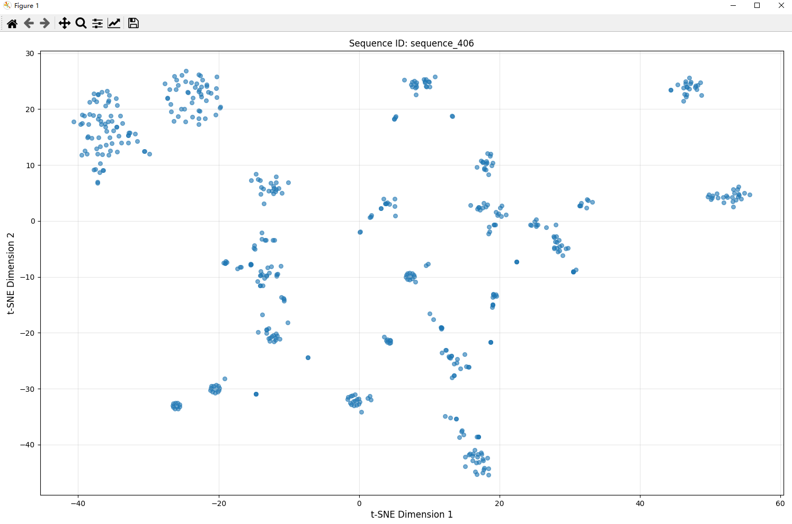

# Plasmid Embedding Visualization Project


This project aims to visualize plasmid sequence embeddings. By leveraging the t - SNE (t - Distributed Stochastic Neighbor Embedding) algorithm, it downsizes high - dimensional embedding data into a two - dimensional space, facilitating an intuitive understanding of the relationships among data points. The project encompasses two primary stages: first, computing the embedding representations of plasmid sequences using a pre - trained model; second, implementing t - SNE dimensionality reduction on the embedding data and visualizing the outcomes.

## Table of Contents

- [Installation](#Installation)
- [Trained model and tokenizer](#Trained-model-and-tokenizer)
- [Embedding Calculation](#Embedding-Calculation)
- [t - SNE Dimensionality Reduction and Visualization](#t---SNE-Dimensionality-Reduction-and-Visualization)
- [Sequence annotation](#Sequence-annotation)

## Installation
Python package dependencies:
- torch 2.5.0
- transformers 4.28.1
- numpy 2.0.2
- PyQt6 6.9.0
- scikit-learn 1.6.1

We recommend using [Conda](https://docs.conda.io/en/latest/index.html) to install our packages. 

1. Create and activate the Conda environment:
   ```bash
   conda env create -f env.yml
   conda activate PlasmidGPT
   ```
2. Install python package dependencies:
   ```bash
   pip install torch numpy transformers matplotlib scikit-learn
   ```

## Trained model and tokenizer
The trained model and tokenizer is availale at [huggingface](https://huggingface.co/lingxusb/PlasmidGPT/tree/main).
- ```pretrained_model.pt```, pretrained PlasmidGPT model, can be accessed [here](https://huggingface.co/lingxusb/PlasmidGPT/blob/main/pretrained_model.pt)
- ```addgene_trained_dna_tokenizer.json```, trained BPE tokenizer on Addgene plasmid sequences, can be accessed [here](https://huggingface.co/lingxusb/PlasmidGPT/blob/main/addgene_trained_dna_tokenizer.json)


## Embedding Calculation
This functionality is embodied in the whole1.py file. The core workflow is as follows:
1.Data Loading: Load the plasmid sequence file and the pre - trained model.
2.Tokenization: Employ the pre - trained tokenizer to tokenize the sequences and append special tokens.
3.Model Inference: Feed the tokenized sequences into the pre - trained model to retrieve the hidden layer states.
4.Embedding Calculation: Determine the mean of the hidden layer states to derive the embedding representation for each sequence.

```python
import re
import torch
import numpy as np
from transformers import PreTrainedTokenizerFast


def parse_sequences(file_path: str) -> dict:
    """Parse FASTA file and return dictionary of sequences"""
    sequences = {}
    current_id = None
    current_seq = []

    with open(file_path, 'r') as file:
        for line in file:
            line = line.strip()
            if line.startswith('>'):
                if current_id is not None:
                    sequences[current_id] = ''.join(current_seq)
                current_id = line[1:]
                current_seq = []
            else:
                cleaned_line = re.sub(r'[^A-Za-z]', '', line.upper())
                if cleaned_line:
                    current_seq.append(cleaned_line)

        if current_id is not None and current_seq:
            sequences[current_id] = ''.join(current_seq)

    return sequences


def process_sequence(sequence, model, tokenizer, device, max_length=1024):
    """Process a single sequence, handling long sequences by chunking"""
    # Tokenize with the same pattern as your original code
    idx = [3] * 10
    tokenized_sequence = idx + [2] + tokenizer.encode(sequence)

    # Split into chunks if too long
    chunks = [tokenized_sequence[i:i + max_length] for i in range(0, len(tokenized_sequence), max_length)]

    hidden_states = []
    for chunk in chunks:
        # Convert to tensor and move to device
        input_ids = torch.tensor([chunk], dtype=torch.long).to(device)

        # Get embeddings
        with torch.no_grad():
            model.config.output_hidden_states = True
            outputs = model(input_ids)
            chunk_hidden = outputs.hidden_states[-1].cpu().numpy()
            chunk_hidden = np.mean(chunk_hidden, axis=1).reshape(-1)
            hidden_states.append(chunk_hidden)

    # Average across chunks if needed
    if len(hidden_states) > 1:
        return np.mean(hidden_states, axis=0)
    elif hidden_states:
        return hidden_states[0]
    else:
        return np.zeros(model.config.hidden_size)  # Return zero vector if empty


def main():
    # File paths
    fasta_file_path = r"D:\PlasmidGPT\plasmids.fasta" #Replace with your file path
    pt_file_path = r"D:\PlasmidGPT\pretrained_model.pt" #Replace with your file path
    tokenizer_path = r"D:\PlasmidGPT\addgene_trained_dna_tokenizer.json" #Replace with your file path

    # Device setup
    device = 'cuda' if torch.cuda.is_available() else 'cpu'
    print(f"Using device: {device}")
    if device == 'cuda':
        print(f"GPU: {torch.cuda.get_device_name(0)}")

    # Load model safely
    try:
        model = torch.load(pt_file_path, map_location=device)
        model.eval()
        model = model.to(device)
        print("Model loaded successfully.")
    except Exception as e:
        print(f"Error loading model: {e}")
        return

    # Load tokenizer
    try:
        tokenizer = PreTrainedTokenizerFast(tokenizer_file=tokenizer_path)
        special_tokens_dict = {'additional_special_tokens': ['[PROMPT]', '[PROMPT2]']}
        num_added_tokens = tokenizer.add_special_tokens(special_tokens_dict)
        print("Tokenizer loaded successfully.")
    except Exception as e:
        print(f"Error loading tokenizer: {e}")
        return

    # Parse sequences
    try:
        sequences = parse_sequences(fasta_file_path)
        print(f"Found {len(sequences)} sequences")
    except Exception as e:
        print(f"Error parsing sequences: {e}")
        return

    # Process each sequence
    hidden_list = []
    sequence_ids = []
    successful = 0

    for seq_id, sequence in sequences.items():
        try:
            if len(sequence) == 0:
                print(f"Skipping empty sequence: {seq_id}")
                continue

            print(f"Processing {seq_id} (length: {len(sequence)})")

            embedding = process_sequence(sequence, model, tokenizer, device)
            hidden_list.append(embedding)
            sequence_ids.append(seq_id)
            successful += 1

        except Exception as e:
            print(f"Error processing sequence {seq_id}: {e}")
            continue

    if hidden_list:
        hidden_array = np.array(hidden_list)
        print(f"Finished calculation of embeddings. Successfully processed {successful}/{len(sequences)} sequences")
        print(f"Embeddings shape: {hidden_array.shape}")

        # Save results
        np.save("sequence_embeddings.npy", hidden_array)
        with open("sequence_ids.txt", "w") as f:
            f.write("\n".join(sequence_ids))
        print("Saved embeddings to sequence_embeddings.npy and sequence IDs to sequence_ids.txt")
    else:
        print("No sequences were successfully processed.")


if __name__ == '__main__':
    main()
```
### command line
To generate plasmid sequence using the model, please run the following command:
```Python
python generate.py --model_dir ../pretrained_model
```
The ```../pretrained_model``` folder should contain the model file and the tokenizer.

The model output will be stored in the ```sequence_embeddings.npy```and```sequence_ids.txt``` file. 
The script should automatically detect whether to use CUDA (GPU) or CPU based on availability. If you encounter a CUDA-related error when running on a CPU-only machine, the script will handle this by falling back to CPU.


### notebooks
Please also check our jupyter notebook [PlasmidGPT_generate.ipynb](https://github.com/lingxusb/PlasmidGPT/blob/main/notebooks/PlasmidGPT_generate.ipynb).

Or, you can easily use our [Colab Notebook](https://colab.research.google.com/drive/1xWbekcTpcGMSiQE6LkRnqSTjswDkKAoc?usp=sharing) in the browser. Please make sure to connect to a GPU instance (e.g., T4 GPU). The notebook will automatically download the pretrained model and tokenizer. The plasmid sequence can be generated based on the user's specified start sequence and downloaded in the ```.fasta``` file format.


## t - SNE Dimensionality Reduction and Visualization
```python
import matplotlib
matplotlib.use('QtAgg')

import numpy as np
from sklearn.manifold import TSNE
import matplotlib.pyplot as plt

# 1. Load the previously saved embeddings and sequence IDs.
embeddings = np.load("sequence_embeddings.npy")
with open("sequence_ids.txt", "r") as f:
    sequence_ids = f.read().splitlines()

print(f"Loaded {len(embeddings)} embeddings of dimension {embeddings.shape[1]}")

# 2. t-SNE dimensionality reduction
print("Running t-SNE...")
tsne = TSNE(
    n_components=2,
    perplexity=15,          # Approximately 1/30 of the data volume 
    early_exaggeration=12,  # Control the initial clustering intensity
    learning_rate=150,      # Recommended value for medium - sized datasets
    max_iter=1500,          # Increase the number of iterations to ensure convergence
    random_state=42,        # Fix the random number generator seed
    init='pca',             # Use PCA for initialization to enhance stability
    metric='cosine'         # A distance metric suitable for text/sequence embeddings
)

embeddings_2d = tsne.fit_transform(embeddings)

# 3. Visualization
plt.figure(figsize=(15, 10))
scatter = plt.scatter(embeddings_2d[:, 0],
                      embeddings_2d[:, 1],
                      alpha=0.6,
                      s=30,  # Point size
                      cmap='viridis')

# Add legends and labels.
plt.title("t-SNE Visualization of Plasmid Sequence Embeddings", fontsize=14)
plt.xlabel("t-SNE Dimension 1", fontsize=12)
plt.ylabel("t-SNE Dimension 2", fontsize=12)
plt.grid(alpha=0.3)

# 4. Add interactive features (mouse hover to display sequence IDs)
def hover(event):
    if scatter.contains(event)[0]:
        ind = scatter.contains(event)[1]["ind"][0]
        plt.gca().set_title(f"Sequence ID: {sequence_ids[ind]}")
        plt.draw()

plt.gcf().canvas.mpl_connect('motion_notify_event', hover)

# 5. Save and display
plt.tight_layout()
plt.savefig("tsne_visualization.png", dpi=300, bbox_inches='tight')
print("Saved visualization to tsne_visualization.png")
plt.show()
```

| Outputs | description |
| ------------- | ------------- |
|  ```sequence_embeddings.npy```  | saved embeddings  |
| ```sequence_ids.txt```  | corresponding IDs  |
|   ```plasmid_tsne.png```| from Embedding Calculation.py  |
| ```tsne_visualization.png```| from t - SNE Dimensionality Reduction and Visualization.py |


### notes
GPU will be auto-detected for acceleration
Ensure correct file paths before running


## Reference
- [PlasmidGPT: a generative framework for plasmid design and annotation](https://www.biorxiv.org/content/10.1101/2024.09.30.615762v1)
- (https://github.com/lingxusb/PlasmidGPT)
